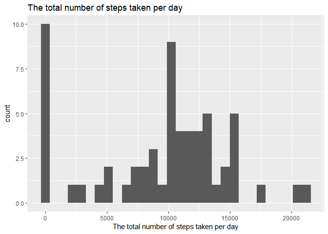
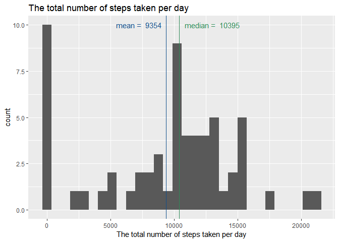
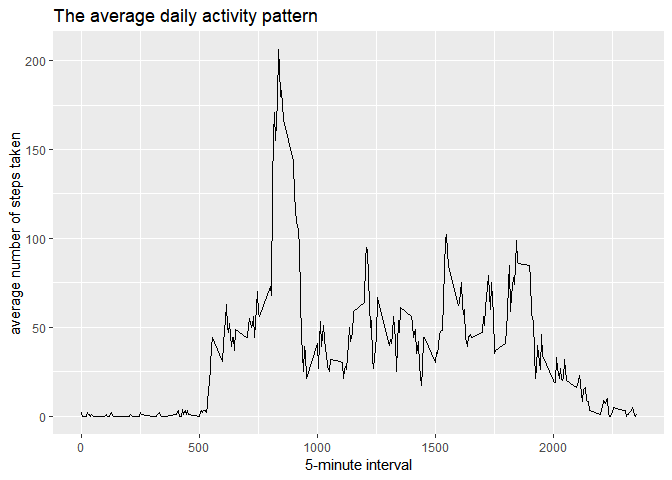
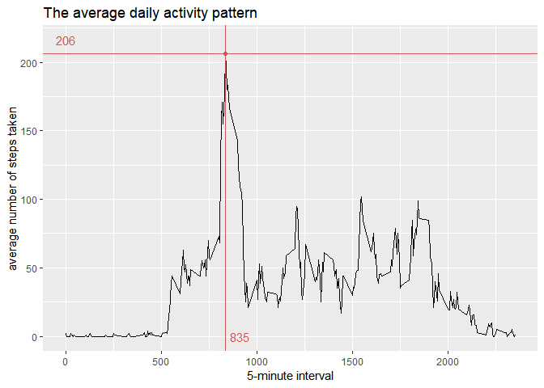
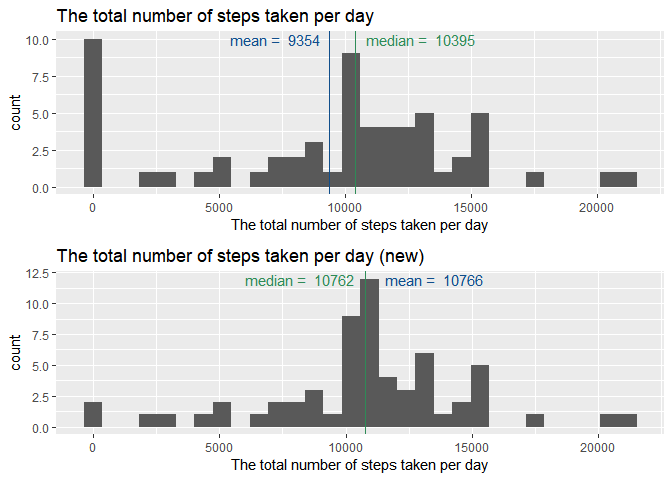
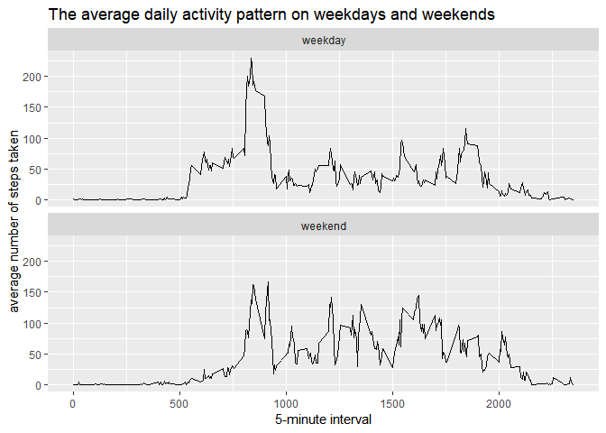

author: ElenaKush
os: Windows 10 version 1803
R version: 3.5.1
Required packages: ggplot2, RColorBrewer, dplyr, knitr, gridExtra

## Loading and preprocessing the data

Loading the packages

```r
if("ggplot2" %in% rownames(installed.packages()) == FALSE){ install.packages("ggplot2") } 
library(ggplot2, quiet=T)
if("RColorBrewer" %in% rownames(installed.packages()) == FALSE){ install.packages("RColorBrewer") } 
library(RColorBrewer, quiet=T)
if("dplyr" %in% rownames(installed.packages()) == FALSE){ install.packages("dplyr") } 
library(dplyr, quiet=T)
```

```
## 
## Attaching package: 'dplyr'
```

```
## The following objects are masked from 'package:stats':
## 
##     filter, lag
```

```
## The following objects are masked from 'package:base':
## 
##     intersect, setdiff, setequal, union
```

```r
if("gridExtra" %in% rownames(installed.packages()) == FALSE){ install.packages("gridExtra") } 
library("gridExtra", quiet=T)
```

```
## 
## Attaching package: 'gridExtra'
```

```
## The following object is masked from 'package:dplyr':
## 
##     combine
```

```r
if("knitr" %in% rownames(installed.packages()) == FALSE){ install.packages("knitr") }
library(knitr, quiet=T)
```

Setting the locale (to set english language for dates)

```r
Sys.setlocale(category = "LC_ALL", locale = "english")
```

```
## [1] "LC_COLLATE=English_United States.1252;LC_CTYPE=English_United States.1252;LC_MONETARY=English_United States.1252;LC_NUMERIC=C;LC_TIME=English_United States.1252"
```

```r
opts_chunk$set(dev="png", fig.path="figure/")
```

*The working directory has been set automatically*

Loading the data

```r
unzip("./activity.zip")
df <- read.csv("activity.csv")
```

Looking at the data

```r
str(df)
```

```
## 'data.frame':	17568 obs. of  3 variables:
##  $ steps   : int  NA NA NA NA NA NA NA NA NA NA ...
##  $ date    : Factor w/ 61 levels "2012-10-01","2012-10-02",..: 1 1 1 1 1 1 1 1 1 1 ...
##  $ interval: int  0 5 10 15 20 25 30 35 40 45 ...
```

```r
head(df)
```

```
##   steps       date interval
## 1    NA 2012-10-01        0
## 2    NA 2012-10-01        5
## 3    NA 2012-10-01       10
## 4    NA 2012-10-01       15
## 5    NA 2012-10-01       20
## 6    NA 2012-10-01       25
```

```r
tail(df)
```

```
##       steps       date interval
## 17563    NA 2012-11-30     2330
## 17564    NA 2012-11-30     2335
## 17565    NA 2012-11-30     2340
## 17566    NA 2012-11-30     2345
## 17567    NA 2012-11-30     2350
## 17568    NA 2012-11-30     2355
```

```r
summary(df)
```

```
##      steps                date          interval     
##  Min.   :  0.00   2012-10-01:  288   Min.   :   0.0  
##  1st Qu.:  0.00   2012-10-02:  288   1st Qu.: 588.8  
##  Median :  0.00   2012-10-03:  288   Median :1177.5  
##  Mean   : 37.38   2012-10-04:  288   Mean   :1177.5  
##  3rd Qu.: 12.00   2012-10-05:  288   3rd Qu.:1766.2  
##  Max.   :806.00   2012-10-06:  288   Max.   :2355.0  
##  NA's   :2304     (Other)   :15840
```

*It is neesesary to formate date column into Date formate and intervals into factors*

Let's convert format of columns 

```r
df$date <- as.Date(df$date)
df$interval <- as.factor(df$interval)
summary(df)
```

```
##      steps             date               interval    
##  Min.   :  0.00   Min.   :2012-10-01   0      :   61  
##  1st Qu.:  0.00   1st Qu.:2012-10-16   5      :   61  
##  Median :  0.00   Median :2012-10-31   10     :   61  
##  Mean   : 37.38   Mean   :2012-10-31   15     :   61  
##  3rd Qu.: 12.00   3rd Qu.:2012-11-15   20     :   61  
##  Max.   :806.00   Max.   :2012-11-30   25     :   61  
##  NA's   :2304                          (Other):17202
```

*So, the first observation was made on 2012-10-01, the last one - on 2012-11-30*

*There is the same amount of observations at each interval (61). So, 61 is the amount of observation days. It looks like the first interval in each day == 0, the last one == 2355*

Let's proove it and take a look at number of rows in each interval

```r
intervals <- aggregate(df$interval, by = list(df$interval), FUN = "length")
tail(intervals)
```

```
##     Group.1  x
## 283    2330 61
## 284    2335 61
## 285    2340 61
## 286    2345 61
## 287    2350 61
## 288    2355 61
```

```r
summary(intervals)
```

```
##     Group.1          x     
##  0      :  1   Min.   :61  
##  5      :  1   1st Qu.:61  
##  10     :  1   Median :61  
##  15     :  1   Mean   :61  
##  20     :  1   3rd Qu.:61  
##  25     :  1   Max.   :61  
##  (Other):282
```

*The hypothese about intervals was correct*


## What is mean total number of steps taken per day?

Let's prepare the dataset (the missing values were removed from the dataset)

```r
df1 <- aggregate(df$steps, by = list(df$date), FUN = sum, na.rm = TRUE)
colnames(df1) <- c("date", "steps_total")
df1$date <- as.Date(df1$date)
head(df1)
```

```
##         date steps_total
## 1 2012-10-01           0
## 2 2012-10-02         126
## 3 2012-10-03       11352
## 4 2012-10-04       12116
## 5 2012-10-05       13294
## 6 2012-10-06       15420
```

Let's make a histogram of the total number of steps taken each day

```r
g1 <- ggplot(df1, aes(steps_total)) +
    geom_histogram() +
    labs(title="The total number of steps taken per day") +
    xlab("The total number of steps taken per day")
g1
```

```
## `stat_bin()` using `bins = 30`. Pick better value with `binwidth`.
```

<!-- -->

Let's calculate the mean and median total number of steps taken per day

```r
df1mean <- round(mean(df1$steps_total), 0)
print(paste("The mean total number of steps taken per day is", df1mean))
```

```
## [1] "The mean total number of steps taken per day is 9354"
```

```r
df1median <- round(median(df1$steps_total), 0)
print(paste("The median total number of steps taken per day is", df1median))
```

```
## [1] "The median total number of steps taken per day is 10395"
```

Let's plot mean and median

```r
g1.2 <- g1 +
    geom_vline(xintercept = df1mean, colour = "dodgerblue4") +
    geom_vline(xintercept = df1median, colour = "seagreen4") +
    annotate("text", df1mean, 10, hjust = +1.1, label = paste("mean = ", df1mean), colour = "dodgerblue4") +
    annotate("text", df1median, 10, hjust = -0.1, label = paste("median = ", df1median), colour = "seagreen4")
g1.2
```

```
## `stat_bin()` using `bins = 30`. Pick better value with `binwidth`.
```

<!-- -->

## What is the average daily activity pattern?

Let's prepare the dataset (the missing values were removed from the dataset)

```r
df2 <- aggregate(df$steps, by = list(df$interval), FUN = mean, na.rm = TRUE)
colnames(df2) <- c("interval", "steps_avg")
head(df2)
```

```
##   interval steps_avg
## 1        0 1.7169811
## 2        5 0.3396226
## 3       10 0.1320755
## 4       15 0.1509434
## 5       20 0.0754717
## 6       25 2.0943396
```

```r
str(df2)
```

```
## 'data.frame':	288 obs. of  2 variables:
##  $ interval : Factor w/ 288 levels "0","5","10","15",..: 1 2 3 4 5 6 7 8 9 10 ...
##  $ steps_avg: num  1.717 0.3396 0.1321 0.1509 0.0755 ...
```
*As we can see from the structure the average amount of steps is a continious number, but in real life the the number of steps should be an integer*

Let's round the average number of steps per interval and convert it

```r
df2$steps_avg <- round(df2$steps_avg, 0)
df2$steps_avg <- as.integer(df2$steps_avg)
```

Let's make a time series plot (i.e. type = "l") of the 5-minute interval (x-axis)
and the average number of steps taken, averaged across all days (y-axis)

```r
g2 <- ggplot(df2, aes(as.numeric(as.character(interval)), steps_avg)) +
    geom_path() +
    labs(title="The average daily activity pattern") +
    xlab("5-minute interval") +
    ylab("average number of steps taken")
g2
```

<!-- -->

Let's see which 5-minute interval, on average across all the days in the dataset,
contains the maximum number of steps

```r
df2max <- df2[df2$steps_avg == max(df2$steps_avg), ]
print(paste("The interval #", df2max[, 1], " contains the maximum number of steps (avg = ", round(df2max[, 2], 2), " steps)", sep = ""))
```

```
## [1] "The interval #835 contains the maximum number of steps (avg = 206 steps)"
```

Let's illustrate this

```r
g2 +
    annotate(geom = "point", as.numeric(as.character(df2max$interval)), df2max$steps_avg, colour = "indianred3") +
    geom_vline(xintercept = as.numeric(as.character(df2max$interval)), colour = "indianred3") +
    geom_hline(yintercept = df2max$steps_avg, colour = "indianred3") +
    annotate(geom = "text", min(as.numeric(as.character(df2$interval))), df2max$steps_avg+10, label = df2max$steps_avg, colour = "indianred3") +
    annotate(geom = "text", as.numeric(as.character(df2max$interval))+75, min(df2$steps_avg), label = df2max$interval, colour = "indianred3")
```

<!-- -->

## Imputing missing values

As we know there are a number of days/intervals where there are missing values
(coded as NA). The presence of missing days may introduce bias into some
calculations or summaries of the data.

Let's calculate and report the total number of missing values in the dataset
(i.e. the total number of rows with NAs)

```r
dfNAtotal <- sum(is.na(df$steps))
print(paste("There are", dfNAtotal, "missing values in the dataset"))
```

```
## [1] "There are 2304 missing values in the dataset"
```

Let's replace NA's with the average for 5-minute interval across all days.
For this purpose, we will use df2, where we counted the average for each 5-minute interval

```r
df3 <- df
df3 <- merge(df3, df2, by.x = "interval", by.y = "interval") ## adding a column with step average
narows <- which(is.na(df3$steps)) ## indices of rows with NAs
df3$steps[narows] <- df3$steps_avg[narows] ## Replacing NAs with an interval averages
```

Let's create a new dataset that is equal to the original dataset but with the
missing data filled in.

```r
## Let's take a look at the original dataset
str(df)
```

```
## 'data.frame':	17568 obs. of  3 variables:
##  $ steps   : int  NA NA NA NA NA NA NA NA NA NA ...
##  $ date    : Date, format: "2012-10-01" "2012-10-01" ...
##  $ interval: Factor w/ 288 levels "0","5","10","15",..: 1 2 3 4 5 6 7 8 9 10 ...
```

```r
## Let's take a look at the new dataset
str(df3)
```

```
## 'data.frame':	17568 obs. of  4 variables:
##  $ interval : Factor w/ 288 levels "0","5","10","15",..: 1 1 1 1 1 1 1 1 1 1 ...
##  $ steps    : int  2 0 0 0 0 0 0 0 0 0 ...
##  $ date     : Date, format: "2012-10-01" "2012-11-23" ...
##  $ steps_avg: int  2 2 2 2 2 2 2 2 2 2 ...
```

```r
## So, we will need to reorder the columns and rows and delete the column "steps_avg"
df3 <- df3[order(df3$date, df3$interval), c(2, 3, 1)]
## Let's take a look at the new dataset
str(df3)
```

```
## 'data.frame':	17568 obs. of  3 variables:
##  $ steps   : int  2 0 0 0 0 2 1 1 0 1 ...
##  $ date    : Date, format: "2012-10-01" "2012-10-01" ...
##  $ interval: Factor w/ 288 levels "0","5","10","15",..: 1 2 3 4 5 6 7 8 9 10 ...
```

Let's make a histogram of the total number of steps taken each day and calculate
and report the mean and median total number of steps taken per day. 

```r
df3.1 <- aggregate(df3$steps, by = list(df3$date), FUN = sum)
colnames(df3.1) <- c("date", "steps_total")
df3.1$date <- as.Date(df3.1$date)
head(df3.1)
```

```
##         date steps_total
## 1 2012-10-01       10762
## 2 2012-10-02         126
## 3 2012-10-03       11352
## 4 2012-10-04       12116
## 5 2012-10-05       13294
## 6 2012-10-06       15420
```

Let's make a histogram of the total number of steps taken each day

```r
g3.1 <- ggplot(df3.1, aes(steps_total)) +
    geom_histogram() +
    labs(title="The total number of steps taken per day (new)") +
    xlab("The total number of steps taken per day")
g3.1
```

```
## `stat_bin()` using `bins = 30`. Pick better value with `binwidth`.
```

-1.png)<!-- -->

Let's calculate the mean and median total number of steps taken per day

```r
df3.1mean <- round(mean(df3.1$steps_total), 0)
print(paste("The mean total number of steps taken per day is", df3.1mean))
```

```
## [1] "The mean total number of steps taken per day is 10766"
```

```r
df3.1median <- round(median(df3.1$steps_total), 0)
print(paste("The median total number of steps taken per day is", df3.1median))
```

```
## [1] "The median total number of steps taken per day is 10762"
```

Let's plot mean and median

```r
g3.2 <- g3.1 +
    geom_vline(xintercept = df3.1mean, colour = "dodgerblue4") +
    geom_vline(xintercept = df3.1median, colour = "seagreen4") +
    annotate("text", df3.1mean, 12, hjust =  -0.2, label = paste("mean = ", df3.1mean), colour = "dodgerblue4") +
    annotate("text", df3.1median, 12, hjust = +1.1, label = paste("median = ", df3.1median), colour = "seagreen4")
g3.2
```

```
## `stat_bin()` using `bins = 30`. Pick better value with `binwidth`.
```

 with stats-1.png)<!-- -->


Let's compare the original dataset total with new dataset totals

Do mean and median differ from the estimates from the first part of the assignment?

What is the impact of imputing missing data on the estimates of the total daily number of steps?

```r
grid.arrange(g1.2, g3.2, ncol = 1)
```

```
## `stat_bin()` using `bins = 30`. Pick better value with `binwidth`.
## `stat_bin()` using `bins = 30`. Pick better value with `binwidth`.
```

<!-- -->

*There are less 0s, the mean and median have moved*

## Are there differences in activity patterns between weekdays and weekends?

The dataset with the filled-in missing values was used for this part.

Let's create a new factor variable in the dataset with two levels - "weekday" and "weekend" indicating whether a given date is a weekday or weekend day.

```r
df4 <- df3
df4$weekday <- weekdays(df4$date)
weekends <- which(df4$weekday %in% c("Saturday", "Sunday")) ## indices of rows with weekends
df4$weekday[weekends] <- "weekend" 
df4$weekday[-weekends] <- "weekday"
df4$weekday <- as.factor(df4$weekday)
str(df4)
```

```
## 'data.frame':	17568 obs. of  4 variables:
##  $ steps   : int  2 0 0 0 0 2 1 1 0 1 ...
##  $ date    : Date, format: "2012-10-01" "2012-10-01" ...
##  $ interval: Factor w/ 288 levels "0","5","10","15",..: 1 2 3 4 5 6 7 8 9 10 ...
##  $ weekday : Factor w/ 2 levels "weekday","weekend": 1 1 1 1 1 1 1 1 1 1 ...
```

Let's prepare the dataset to make a plot of the 5-minute interval (x-axis) and the average number of steps taken, averaged across all weekday days or weekend days (y-axis)

```r
df4.2 <- aggregate(df4$steps, by = c(list(df4$interval), list(df4$weekday)), FUN = mean)
colnames(df4.2) <- c("interval", "weekday", "steps_avg")
head(df4.2)
```

```
##   interval weekday  steps_avg
## 1        0 weekday 2.28888889
## 2        5 weekday 0.40000000
## 3       10 weekday 0.15555556
## 4       15 weekday 0.17777778
## 5       20 weekday 0.08888889
## 6       25 weekday 1.57777778
```

```r
str(df4.2)
```

```
## 'data.frame':	576 obs. of  3 variables:
##  $ interval : Factor w/ 288 levels "0","5","10","15",..: 1 2 3 4 5 6 7 8 9 10 ...
##  $ weekday  : Factor w/ 2 levels "weekday","weekend": 1 1 1 1 1 1 1 1 1 1 ...
##  $ steps_avg: num  2.2889 0.4 0.1556 0.1778 0.0889 ...
```

*As we can see from the structure the average amount of steps is a continious number, but in real life the the number of steps should be an integer*

Let's round the average number of steps per interval and convert it

```r
df4.2$steps_avg <- round(df4.2$steps_avg, 0)
df4.2$steps_avg <- as.integer(df4.2$steps_avg)
```


Let's make a panel plot containing a time series plot (i.e. type="l") of the 5-minute interval (x-axis) and the average number of steps taken, averaged across all weekday days or weekend days (y-axis).

```r
g4 <- ggplot(df4.2, aes(as.numeric(as.character(interval)), steps_avg)) +
    geom_line() +
    facet_wrap(aes(weekday), nrow = 2) +
    labs(title="The average daily activity pattern on weekdays and weekends") +
    xlab("5-minute interval") +
    ylab("average number of steps taken")
g4
```

<!-- -->

knit2html("PA1_template.Rmd")
